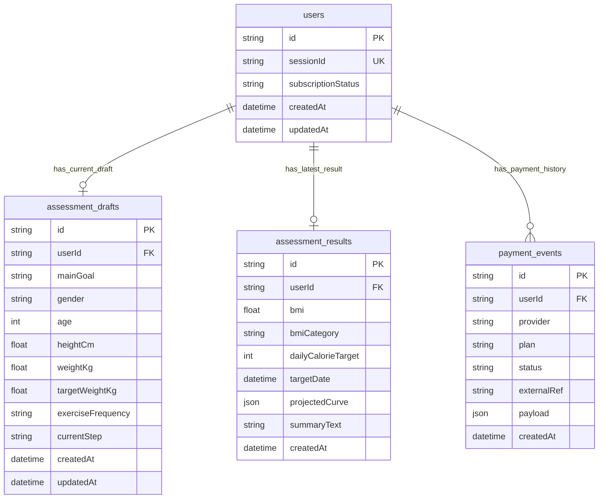

# Health Assessment Challenge

A lightweight health assessment backend built with `Next.js + TypeScript + Prisma + PostgreSQL`.

This project focuses on the core engineering loop required by the challenge:

- reviewer-friendly frontend funnel
- step-by-step persistence
- progress recovery
- server-side health calculation
- subscription-gated result access
- mock payment callback
- automated tests around core logic and edge cases

Last verified locally on **2026-08-30**.

## Live demo

- Public app URL: _pending deploy_
- GitHub: _pending push_
- Unpaid reviewer session: `sess_reviewer_free_demo`
- Paid reviewer session: `sess_reviewer_paid_demo`

Compare gated vs full results after deploy:

```bash
curl -s "$APP_URL/api/results" -H "x-session-id: sess_reviewer_free_demo"
curl -s "$APP_URL/api/results" -H "x-session-id: sess_reviewer_paid_demo"
```

## Tech Stack

- `Next.js` App Router
- `TypeScript`
- `Prisma`
- `PostgreSQL`
- `Zod`
- `Vitest`

## What Is Implemented

### Day 1

- funnel data model narrowed to the challenge-required fields
- database schema for user, draft, result, and payment records
- `POST /api/sessions` to create a recoverable session
- `PATCH /api/assessment` for step-by-step incremental persistence
- `GET /api/assessment` for progress recovery after refresh or interruption

### Day 2

- `POST /api/assessment/complete` to compute and persist the assessment result
- server-side calculation for:
  - `bmi`
  - `bmiCategory`
  - `dailyCalorieTarget`
  - `targetDate`
  - `projectedCurve`
  - `summaryText`
- `GET /api/results` with subscription-aware differential response
- `POST /pay` mock payment callback to activate subscription status

### Day 3

- interactive frontend funnel wired to the backend routes
- automated unit and route-level tests for core logic and edge cases
- README documentation
- validation and flow review

## Project Structure

```text
app/
  api/
    assessment/
      complete/route.ts
      route.ts
    results/route.ts
    sessions/route.ts
  pay/route.ts
lib/
  assessment-engine.ts
  current-user.ts
  prisma.ts
  results.ts
  validation/
prisma/
  schema.prisma
```

## Local Setup

### 1. Install dependencies

```bash
npm install
```

### 2. Configure PostgreSQL

Set `DATABASE_URL` in `.env`.

Example:

```bash
DATABASE_URL="postgresql://tianfan@localhost:5432/health_assessment_challenge?schema=public"
```

### 3. Generate Prisma client and sync schema

```bash
npm run prisma:generate
npx prisma db push
npm run seed:reviewer
```

This creates two reusable reviewer sessions:

- `sess_reviewer_free_demo`
- `sess_reviewer_paid_demo`

### 4. Start the app

```bash
npm run dev
```

App runs at [http://localhost:3000](http://localhost:3000).

## One-Command Quality Checks

```bash
npm test
npm run lint
npm run typecheck
npx next build --webpack
```

Current local status as of **2026-08-30**:

- `npm test`: 9 files, 50 tests passed
- `npm run lint`: passed
- `npm run typecheck`: passed

## Database Schema

The current schema uses four tables because the challenge asks us to demonstrate:

- user/session identity
- in-progress assessment persistence
- finalized calculation result persistence
- payment/subscription state changes

### Tables

#### `users`

Stores the recoverable session identity and current subscription state.

Key fields:

- `id`
- `sessionId`
- `subscriptionStatus`
- `createdAt`
- `updatedAt`

#### `assessment_drafts`

Stores the latest in-progress answers for the current funnel.

Key fields:

- `id`
- `userId`
- `mainGoal`
- `gender`
- `age`
- `heightCm`
- `weightKg`
- `targetWeightKg`
- `exerciseFrequency`
- `currentStep`
- `createdAt`
- `updatedAt`

#### `assessment_results`

Stores the finalized server-side computed result after completion.

Key fields:

- `id`
- `userId`
- `bmi`
- `bmiCategory`
- `dailyCalorieTarget`
- `targetDate`
- `projectedCurve`
- `summaryText`
- `createdAt`

#### `payment_events`

Stores mock payment callback history and gives us an auditable subscription transition trail.

Key fields:

- `id`
- `userId`
- `provider`
- `plan`
- `status`
- `externalRef`
- `payload`
- `createdAt`

### Relationship Diagram



## API Overview

### `POST /api/sessions`

Creates a recoverable session and sets an httpOnly cookie.

Response:

```json
{
  "sessionId": "sess_xxx",
  "subscriptionStatus": "INACTIVE"
}
```

### `GET /api/assessment`

Returns the latest saved draft so the user can resume progress.

Response:

```json
{
  "sessionId": "sess_xxx",
  "currentStep": "body-metrics",
  "profile": {
    "mainGoal": "LOSE_WEIGHT",
    "gender": "FEMALE",
    "age": 26,
    "heightCm": 168,
    "weightKg": null,
    "targetWeightKg": null,
    "exerciseFrequency": null
  }
}
```

### `PATCH /api/assessment`

Saves one incremental step at a time.

Example request:

```json
{
  "step": "goal",
  "data": {
    "mainGoal": "LOSE_WEIGHT"
  }
}
```

Example response:

```json
{
  "success": true,
  "currentStep": "gender",
  "profile": {
    "mainGoal": "LOSE_WEIGHT",
    "gender": null,
    "age": null,
    "heightCm": null,
    "weightKg": null,
    "targetWeightKg": null,
    "exerciseFrequency": null
  }
}
```

### `POST /api/assessment/complete`

Validates the required draft fields, calculates the result, and persists it.

Non-members still get a result id, but the payload is gated the same way as `GET /api/results`. Protected fields are not returned from this endpoint.

Inactive subscription response:

```json
{
  "success": true,
  "resultId": "cmtem3k1v000h8o0vnnfs1t11",
  "subscriptionStatus": "INACTIVE",
  "paywall": {
    "isLocked": true,
    "message": "Unlock your full assessment to view your calorie target, timeline, and projected progress.",
    "lockedFields": ["dailyCalorieTarget", "targetDate", "projectedCurve"]
  },
  "result": {
    "bmi": 23.03,
    "bmiCategory": "NORMAL",
    "summaryText": "Your BMI is currently within the normal range. A moderate calorie deficit can help you work toward your goal at a steady pace."
  }
}
```

### `GET /api/results`

Returns different payloads based on `subscriptionStatus`.

Inactive subscription response:

```json
{
  "subscriptionStatus": "INACTIVE",
  "paywall": {
    "isLocked": true,
    "message": "Unlock your full assessment to view your calorie target, timeline, and projected progress.",
    "lockedFields": ["dailyCalorieTarget", "targetDate", "projectedCurve"]
  },
  "result": {
    "bmi": 23.03,
    "bmiCategory": "NORMAL",
    "summaryText": "Your BMI is currently within the normal range. A moderate calorie deficit can help you work toward your goal at a steady pace."
  }
}
```

Active subscription response:

```json
{
  "subscriptionStatus": "ACTIVE",
  "paywall": {
    "isLocked": false,
    "message": null,
    "lockedFields": []
  },
  "result": {
    "bmi": 23.03,
    "bmiCategory": "NORMAL",
    "dailyCalorieTarget": 1537,
    "targetDate": "2026-12-05",
    "projectedCurve": [
      { "date": "2026-08-29", "weightKg": 65 },
      { "date": "2026-09-12", "weightKg": 64.27 }
    ],
    "summaryText": "Your BMI is currently within the normal range. A moderate calorie deficit can help you work toward your goal at a steady pace."
  }
}
```

### `POST /pay`

Mock payment callback that activates subscription access.

Request:

```json
{
  "provider": "mock",
  "plan": "monthly"
}
```

Response:

```json
{
  "success": true,
  "subscriptionStatus": "ACTIVE",
  "paymentEventId": "cmtem62iv000j8o0vcgjpbr2y"
}
```

## Manual Verification Flow

The core flow was manually verified locally on **2026-08-29**:

### Create session

```bash
curl -i -c cookies.txt -X POST http://localhost:3000/api/sessions
```

### Save incremental steps

```bash
curl -i -b cookies.txt -X PATCH http://localhost:3000/api/assessment \
  -H "Content-Type: application/json" \
  -d '{
    "step": "goal",
    "data": {
      "mainGoal": "LOSE_WEIGHT"
    }
  }'
```

### Restore progress

```bash
curl -i -b cookies.txt http://localhost:3000/api/assessment
```

### Complete assessment

```bash
curl -i -b cookies.txt -X POST http://localhost:3000/api/assessment/complete
```

### View locked result

```bash
curl -i -b cookies.txt http://localhost:3000/api/results
```

### Activate subscription

```bash
curl -i -b cookies.txt -X POST http://localhost:3000/pay \
  -H "Content-Type: application/json" \
  -d '{
    "provider": "mock",
    "plan": "monthly"
  }'
```

### View unlocked result

```bash
curl -i -b cookies.txt http://localhost:3000/api/results
```

## Session identity

The browser uses an httpOnly cookie. API clients can also pass a session id without cookies:

- header: `x-session-id: sess_xxx`
- query: `?sessionId=sess_xxx`

Cookie wins if both are present.

## Test Coverage

Run everything with:

```bash
npm test
```

That command runs:

- unit tests for the assessment algorithm and step ordering
- route tests for validation, restore, gated results, and `/pay`
- a pay-then-results flow test
- database-backed integration tests when `DATABASE_URL` or `TEST_DATABASE_URL` is available

CI runs the same command against a fresh Postgres service.

Covered:

- BMI, calorie target, and target-date calculation
- BMI category boundaries (`18.5`, `25`, `30`)
- calorie floors for low-energy female and male cases
- missing draft fields
- invalid target weight for a weight-loss goal
- extreme / illegal age, height, weight, and target weight in both the algorithm and the PATCH API
- string / type injection on numeric fields
- complete-route revalidation of out-of-range stored drafts
- progress restore after interruption
- out-of-order and duplicate step submission
- concurrent step updates (integration)
- inactive result paywall, including the guarantee that protected fields are absent
- complete-route paywall, so non-members cannot read `projectedCurve` from `/api/assessment/complete`
- `/pay` success, malformed JSON, invalid payload, and unauthorized paths
- `/pay` then `GET /api/results` switching from masked to full
- session restore via `x-session-id`

Not covered yet:

- a live production smoke test against the deployed URL
- real payment-provider webhooks (this project uses a mock `/pay` callback)

## Deployment checklist

The challenge requires a public URL. After the code is on GitHub:

1. Create a hosted Postgres database (Neon, Supabase, or Railway).
2. Deploy the app on Vercel (or similar) with `DATABASE_URL`.
3. Run `npx prisma db push` against production, or use the Vercel build to generate the client and then push the schema.
4. Run `APP_URL=https://your-app.vercel.app npm run seed:reviewer` with production `DATABASE_URL`.
5. Put the live URL, replayable `/pay` curl, and these session ids in this README:

- unpaid: `sess_reviewer_free_demo`
- paid: `sess_reviewer_paid_demo`

Replay against production:

```bash
curl -s "$APP_URL/api/results" -H "x-session-id: sess_reviewer_free_demo"
curl -s "$APP_URL/pay" -H "content-type: application/json" -H "x-session-id: sess_reviewer_free_demo" -d '{"provider":"mock","plan":"monthly"}'
curl -s "$APP_URL/api/results" -H "x-session-id: sess_reviewer_free_demo"
curl -s "$APP_URL/api/results" -H "x-session-id: sess_reviewer_paid_demo"
```

## CI

GitHub Actions workflow: `.github/workflows/ci.yml`.

On `push` and `pull_request` it:

- installs dependencies with `npm ci`
- generates the Prisma client
- pushes the schema to a Postgres service
- runs lint, typecheck, and `npm test`

## Submission Gaps To Finish

Still needed before sending the email:

- push this repo to GitHub so CI can show a passing badge
- deploy a public URL and paste it at the top of this README
- run `npm run seed:reviewer` against production and keep `sess_reviewer_paid_demo` / `sess_reviewer_free_demo`

## Notes on Design Choices

- Only the challenge-required fields are used for calculation. I intentionally did not overfit the backend to every BetterMe onboarding question.
- `assessment_drafts` and `assessment_results` are separate because draft state and finalized computed state have different lifecycles.
- `payment_events` exists to make subscription changes auditable and easier to extend later to real payment providers.
- Non-members can still see meaningful feedback instead of a blank denial page, but protected fields remain hidden.
- `POST /api/assessment/complete` uses the same paywall as `GET /api/results`, so completing the quiz is not a back door to the full plan.

## AI Collaboration Retrospective

### How AI was used

- refine table boundaries and naming
- pressure-test API shapes
- generate validation scaffolding
- propose test cases for edge paths
- review whether the result payload was correctly split between free and paid access

### Where AI helped most

- turning the challenge brief into a smaller, cleaner backend scope
- quickly enumerating validation edge cases
- generating route test scenarios that were then manually reviewed and adjusted

### One AI suggestion I rejected

An early direction was to return the full calculated payload from `POST /api/assessment/complete` and only gate `GET /api/results`.

That would have made the funnel feel simpler, but it would also let a non-member recover calorie targets, the target date, and the projected curve without paying. I rejected it: complete now persists the full result internally and returns the same paywalled payload as the results API.

A second early suggestion was to mirror a much larger BetterMe-style profile and feed many lifestyle questions directly into the algorithm.

I also rejected that because the challenge explicitly requires the core calculation to be based on the first-stage health data. For this submission, the algorithm stays grounded in the fields that matter most to the brief:

- `mainGoal`
- `gender`
- `age`
- `heightCm`
- `weightKg`
- `targetWeightKg`
- `exerciseFrequency`

That keeps the system easier to validate, easier to test, and easier to explain.

## License

Challenge project for evaluation use.
